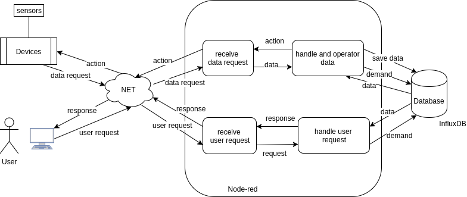
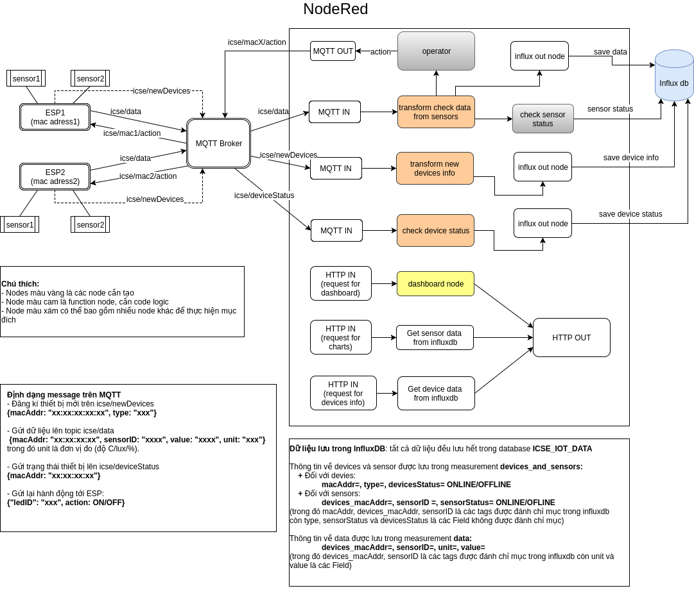

### **Project 2**
**Xây dựng hệ thống giám sát các device, sensor, lưu trữ dữ liệu và data visualization.**

Để xây dựng lên hệ thống cần sử dụng:

#### **1. Các thiết bị phần cứng**

**Thiết bị**: 2 esp8266, 1 cảm biến nhiệt độ LM35, 1 cảm biến nhiệt độ độ ẩm DHT11, 1 cảm biến cường độ ánh sáng BH1750, 4 bóng đèn led.

**Nối mạch**: esp1 nối với 1 cảm biến nhiệt độ độ ẩm và 2 đèn led, esp2 nối với 1 cảm biến nhiệt độ và 1 cảm biến cường độ ánh sáng và 2 đèn led.

Các thông tin đặc trưng của devices và sensor:

- Devices: mac address, type (E.g. Esp8266, Uno, Pi...)
- Sensors: sensorID (do người dùng tự định nghĩa), device_mac_address, unit (đơn vị 	đo)

#### **2. Các công nghệ sử dụng chính:**

+ Node-red: đóng vai trò làm webserver cung cấp giao diện người dùng, đồng thời là nơi xử lý dữ liệu để lưu vào trong cơ sở dữ liệu, thực hiện các luồng logic để đưa ra các action cho các devices.
+ Ardunio: thực hiện code firmware cho devices
+ MQTT: giao thức được sử dụng để truyền nhận message.
+ InfluxDB: timeserial database để lưu trữ dữ liệu thu thập được.
+ Docker: sử dụng để đóng gói các phần (E.g: Node-red server, MQTT broker, InfluxDB server) và triển khai hệ thống.

#### **3. Hệ thống**

Mô hình tổng quan về hệ thống

Như trong mô hình trên ta có thể thấy trong hệ thống sẽ có 2 luồng xử lý chính, đó là:

- Nhận và xử lý dữ liệu từ các thiết bị, lưu dữ liệu vào csdl và thực hiện các tính toán để 	đưa ra actions cho thiết bị.
- Nhận và xử lý các request từ người dùng như các yêu cầu hiển thị thông tin, trạng thái 	các devices, sensors, hiển thị các biểu đồ dữ liệu.

Đối tượng **User** ở trong hình là chỉ người dùng cuối (không phải nhà phát triển sử dụng giao diện kéo thả của node-red), sẽ truy cập vào giao diện người dùng để xem các thông tin về devices, sensor và các biểu đồ dữ liệu, thông qua việc gửi các HTTP Request.

#### **Connection**

Để xây dựng 1 hệ thống, vấn đề đầu tiên đó là việc giao tiếp giữa các thành phần.
Như trong hệ thống tổng quan bên trên, ta có thể chia hệ thống thành 3 thành phần chính cần giao tiếp với nhau. Đó là 

	Devices <=> Node-red <=> Database server

Do dữ liệu từ các devices gửi về là real-time, nên ta cần sử dụng 1 time serial database. Do đó giải pháp đưa ra là sử dụng InfluxDB, cung cấp các  HTTP API để thực hiện việc truy vấn và insert dữ liệu từ Node-red.

Việc liên kết giữa các Devices và Node-red sẽ sử dụng giao thức MQTT. MQTT là giao thức truyền thông điệp theo mô hình publish/subscribe, sử dụng băng thông thấp, độ tin cậy cao và có khả năng hoạt động trong điều kiện đường truyền không ổn định. 

Hình dưới là mô tả cụ thể các thành phần và luồng hoạt động của hệ thống.

Các chức năng của hệ thống bao gồm: 

- Đăng kí device mới lên hệ thống
- Tự động phát hiện ra các sensor mới trên hệ thống và lưu vào cơ sở dữ liệu.
- Kiểm tra trạng thái của các devices và sensors.
- Thực hiện các hành động, tính toán xử lý để gửi lại action cho các devices.
- Hiển thị giao diện cho phép người dùng thấy các thông tin và trạng thái của 	devices/sensors, và hiển thị dữ liệu dưới dạng các biểu đồ.

#### **Các topic trên MQTT**

**icse/data**: các devices sẽ gửi dữ liệu đo được từ sensor lên topic với định dạng thông điệp:

	{macAddr: "xx:xx:xx:xx", sensorID: "yy", value: "zz", unit: "kk"}

Trong đó: 

- macAddr là địa chỉ mac của device,
- sensorID: định danh của sensor
- value: giá trị dữ liệu đo được
- unit: đơn vị đo (độ C/%/lux)
			
**icse/newDevices**: khi có 1 device mới, sẽ gửi thông tin đăng kí lên với định dạng:

	{macAddr: "xx:xx:xx:xx:xx", type: "xxx"}
	
Trong đó: macAddr là địa chỉ mac của device, type là kiểu (E.g: ESP, Uno, Pi)

**icse/XX/action**: node-red gửi action tới device có địa chỉ mac là XX với định dạng:

	{"ledID": "xxx", action: ON/OFF} để điều khiển đèn led
	{type: “subcribeNewDevice”, status: “OK”} để thông báo đăng kí thiết bị mới thành 	công

**icse/XX/deviceStatus**: topic để device có **macAddr** là **XX** sẽ connect tới và đăng kí 1 **Last Will Message** với định dạng: 

	{macAddr: "xx:xx:xx:xx:xx", status: "OFFLINE"}
	
Sử dụng Last Will Message là việc 1 client sẽ connect tới 1 topic trên MQTT broker và đính kèm theo 1 message để khi client này ngoại tuyến thì MQTT broker sẽ public message đó lên trên topic. Sử dụng điều này để xác định khi nào thì device bị ngoại tuyến.

#### **Cơ sở dữ liệu: ICSE_IOT_DATA**

Cơ sở dữ liệu sẽ được thiết kế theo BigTable, bao gồm 2 bảng **devices_and_sensors** và **data:** 

**Bảng 1: devices_and_sensors**: lưu thông tin về devices và sensor,

- Đối với devices:

		macAddr  |	type  |  devicesStatus (ONLINE/OFFLINE)

- Đối với sensors:

		devices_macAddr  |  sensorID  |  sensorStatus (ONLINE/OFLINE)

trong đó các trường macAddr, devices_macAddr, sensorID là các **tags** được đánh chỉ mục.
(**sensorID** có định dạng: **XX-sensor_id** với **XX** là địa chỉ **mac** của device mà sensor đó thuộc, còn **sensor_id*** là do người dùng tự đặt)

**Bảng 2: data**: lưu toàn bộ dữ liệu thu thập được từ devices:

		device_macAddr |  sensorID  |  unit  |  value
		
trong đó các trường device_macAddr, sensorID là các tags được đánh chỉ mục.

#### **Họat động của ESP**
Khi code fimrware sẽ tự định nghĩa các sensorID.
Connect và subscribe topic **icse/XX/action** với **XX** là macaddress của device đó.

Sử dụng 1 biến checkSum trong bộ nhớ EEPROM để kiểm tra xem đã gửi thông tin đăng kí thiết bị mới chưa. Nếu chưa thì sẽ gửi thông điệp có định dạng sau lên topic **icse/newDevices**:

	{macAddr: "xx:xx:xx:xx:xx", type: "xxx"}
	
đến khi nào **nhận** được message trả về thành công trên topic **icse/XX/action** với định dạng:

	{type: “subcribeNewDevice”, status: “OK”}
	
Thiết lập 1 khoảng thời gian interval là **10s**, sau mỗi 10s lại gửi message đăng kí lên cho tới khi nào nhận được thông điệp thành công.

Khi nhận được action trên topic **icse/XX/action** với định dạng:

	{"ledID": "xxx", action: ON/OFF}
	
thì sẽ thực hiện việc bật tắt đèn với id tương ứng.

#### **Hoạt động xử lý dữ liệu của Node-red**

Bao gồm 3 hoạt động chính, tương ứng với khi nhận được 3 loại thông điệp từ MQTT Broker.

**Hoạt động 1**: khi nhận được dữ liệu từ device trên topic icse/data:

Đầu vào:

	{macAddr: "xx:xx:xx:xx:xx", sensorID: "yy", value: "zz", unit: "kk"}
	
Đầu ra: 3 đầu ra

- Lưu dữ liệu vào trong database
- Kiểm tra trạng thái sensor và thông tin sensor.
- Đưa ra hành động cho device.

Cụ thể:
Khi nhận được dữ liêu, 

1 - Đầu tiên sẽ tiến hành kiểm tra xem sensor này đã có trong cơ sở dữ liệu hay chưa. Nếu chưa có thì sẽ thêm thông tin vào cơ sở dữ liệu với **status ** là **ONLINE** và **sensorID** là **XX-yy** với **XX** là **mac address** của device còn **yy** là **sensor id** mà người dùng tự định nghĩa, được gửi trong message:

	devices_macAddr= "xx:xx:xx:xx:xx", sensorID="xx:xx:xx:xx:xx-yy", sensorStatus= 	ONLINE

Sau đó tiến hành kiểm tra định dạng dữ liệu tương ứng với đơn vị đo **unit** để kiểm tra xem sensor đó còn hoạt động đúng hay không. Các định dạng dữ liệu ứng với đơn vị đo tương ứng là:

		C: [1, 100]; 	%: [0, 100],	lux: [1, 65535]
		
- Nếu dữ liệu không đúng định dạng, nếu là sensor mới thì sẽ lưu thông tin với status là 	OFFLINE, còn nếu là sensor đã có trong cơ sở dữ liệu thì thực hiện kiểm tra status mới 	nhất của sensor này trong cơ sở dữ liệu với status hiện tại. Nếu khác nhau thì sẽ lưu 	status mới của thiết bị. 

- Nếu dữ liệu đúng định dạng thì lưu vào database:

		{macAddr: "xx:xx:xx:xx:xx", sensorID: "xx:xx:xx:xx:xx-yy", value: "zz", unit: "kk"}

2 - Đưa ra hành động cho device thông qua việc tắt bật đèn led:

- Khi dữ liệu là nhiệt độ > ngưỡng hoặc không đúng định dạng thì đèn led1 với ledID là 	LED1 bật (ON), còn nếu đúng định dạng thì đèn led1 tắt (OFF):

		{ledID: “LED1”, action: “ON/OFF”}

- Khi dữ liệu là độ ẩm hoặc ánh sáng > ngưỡng hoặc không đúng định dạng thì đèn led2 	với ledID là LED2 bật (ON), còn nếu đúng định dạng thì đèn led2 tắt (OFF)

		{ledID: “LED2”, action: “ON/OFF”}

**Hoạt động 2**: khi nhận được dữ liệu trên topic **icse/newDevices**:

Đầu vào:

	{macAddr: "xx:xx:xx:xx:xx", type: "xxx"}

Đầu ra:
	
- Lưu dữ liệu về device mới vào database:
	
		macAddr: "xx:xx:xx:xx:xx", type: "xxx",  devicesStatus= ONLINE

- Gửi message với định dạng dưới lên topic icse/XX/action với XX là macAddr nhận 	được trong message:

		{type: “subcribeNewDevice”, status: “OK”}
		
Cụ thể: 
Khi nhận được dữ liệu đăng kí device mới, kiểm tra xem device này đã có trong cơ sở dữ liệu hay chưa, nếu có thì tiến hành lưu trữ vào cơ sở dữ liệu và public message đăng kí thành công tới cho device.

**Hoạt động 3**: khi nhận được dữ liệu trên topic **icse/deviceStatus**:

Đầu vào:

	{macAddr: "xx:xx:xx:xx:xx", status: "OFFLINE"}

Đầu ra: 

Lưu thông tin về device OFFLINE:

	macAddr: "xx:xx:xx:xx:xx", type: "xxx", devicesStatus= OFFLINE
	
và lưu thông tin của tất cả các sensor trên device này có trạng thái ONLINE thành OFFLINE:

	devices_macAddr= "xx:xx:xx:xx:xx", sensorID="xx:xx:xx:xx:xx-yy", sensorStatus=OFFLINE
